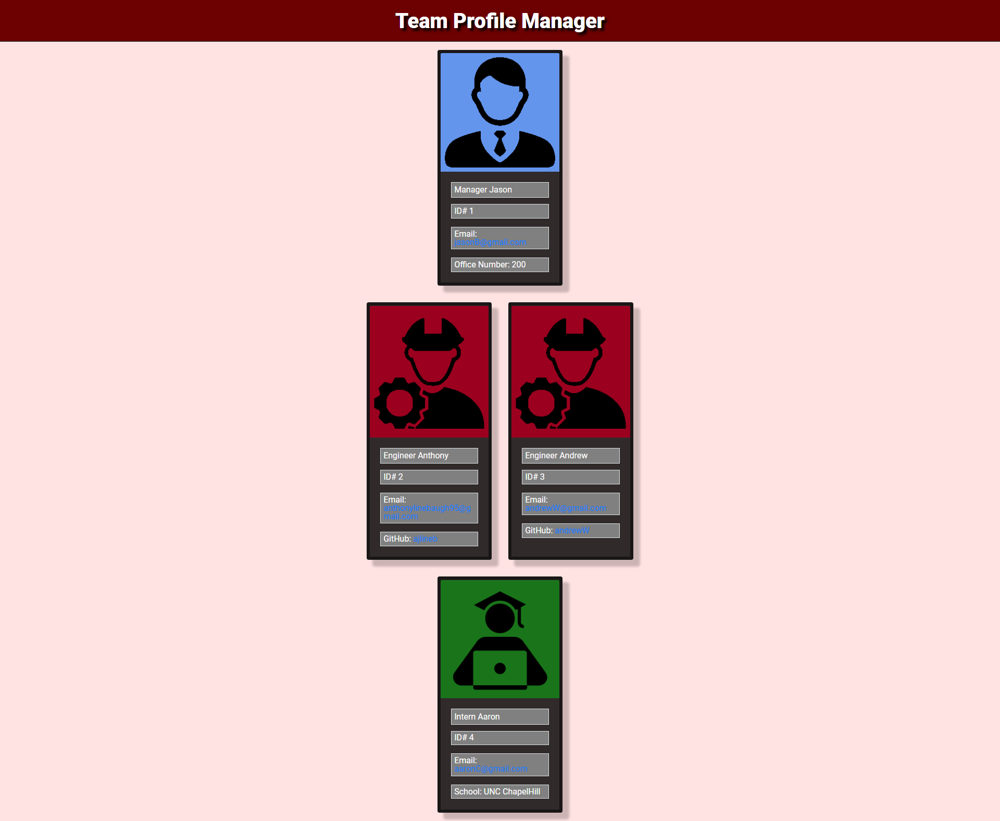

# Team Profile Generator   

## Table of Contents  

* [Installation](#installation)
* [Description](#description)
* [URLs](#urls)
* [Usage](#usage)
* [Images](#images)
* [Credits](#credits)
* [License](#license)
* [Contributions](#contributions)
* [Tests](#tests)
* [Questions](#questions)

## Installation  

Make sure to have node installed, jest and inquirer installed.  

## Description  

This application can be used to build your team and access their informaion when needed! You can add a manager, multiple engineers, and multiple interns. The prompts will ask diffrent questions based on the type of member (engineer/intern). Engineers will have a github and interns have a school field. When finished adding members to your team it will generate a html page fully styled and will put the Manager at the top followed by the engineers which are then followed by interns, making almost a tree/pyramid styled member list! Sending emails to your members are as easy as clicking their email, as it will bring up your default emailer so you can quickly send a message! Also your engineers github accounts can simply be clicked on to take you to their page. All of your team wrapped up in one page!  

## URLs  

GitHub repository: https://github.com/ajlineb/Team-Profile-Generator  

Video: https://drive.google.com/file/d/1NjXKrunPdA6OKeY0peKev2sTKYe8phHc/view  

## Usage  

This application creates your team with simple questions and displays them on an html page fully styled with css. It makes it easier for building your team and getting in contact with your members.  

## Images  

  

## Credits  

Google fonts, and Bootstrap  

## License  

MIT License  

## Contributions  

n/a  

## Tests  

To test the project, in the console type: npm run test  

## Questions  

Contact by:  
GitHub Username: [ajlineb](https://github.com/ajlineb)  
Email: anthonylinebaugh95@gmail.com